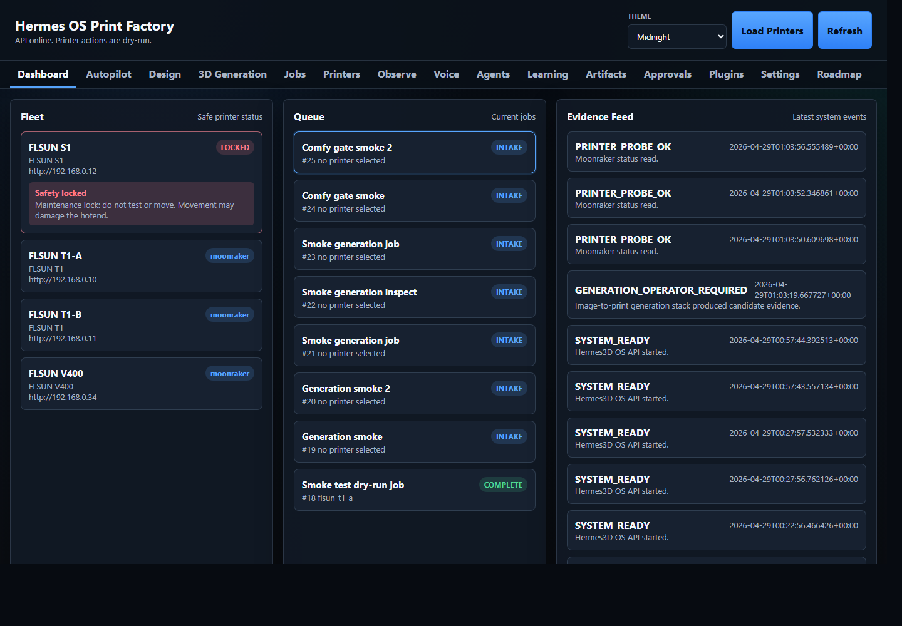
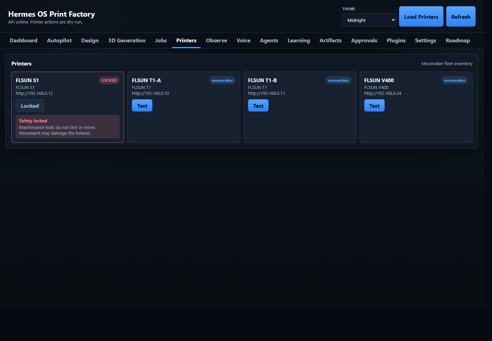
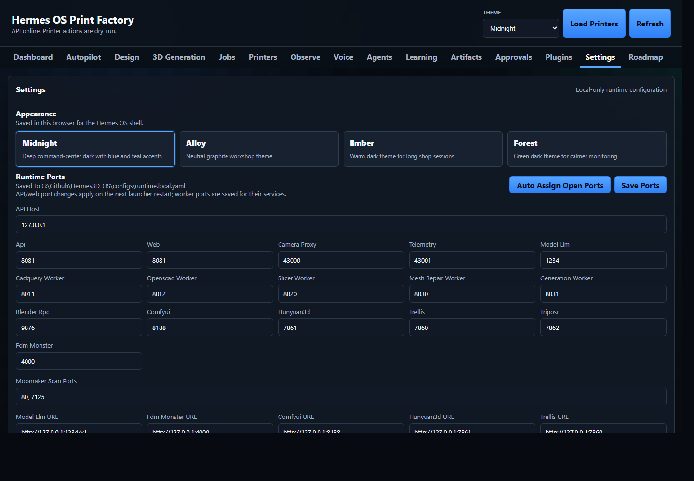

# UI Visual Proof

Captured on 2026-04-28 local time against the live local app at `http://127.0.0.1:8081/`.

The current Hermes OS Print Factory UI uses a dark default `Midnight` theme and supports saved theme switching for:

- Midnight
- Alloy
- Ember
- Forest

## Truth Checks

- Live app title: `Hermes OS Print Factory`
- Default theme: `midnight`
- OS tabs present: 15
- Theme selector present in the topbar
- Settings page theme swatches switch the live `body[data-theme]` value
- FLSUN S1 is visible but maintenance locked
- FLSUN S1 test action is disabled
- Runtime, worker, slicer, ComfyUI, TRELLIS, Hunyuan3D, TripoSR, FDM Monster, and Moonraker ports are editable and saved through Settings
- Visual proof was captured without probing, moving, or testing the FLSUN S1

## Pixel Check

The screenshot set was sampled for brightness. Average luminance stayed between `22.4` and `41.1` on a 0-255 scale. The highest near-white pixel percentage was `4.1%`, from text and evidence thumbnails rather than page backgrounds.

## Screenshots

| Page | Proof |
| --- | --- |
| Dashboard | [01-dashboard.png](ui-proof/01-dashboard.png) |
| Autopilot | [02-setup.png](ui-proof/02-setup.png) |
| Design | [03-design.png](ui-proof/03-design.png) |
| 3D Generation | [04-generation.png](ui-proof/04-generation.png) |
| Jobs | [05-jobs.png](ui-proof/05-jobs.png) |
| Printers | [06-printers.png](ui-proof/06-printers.png) |
| Observe | [07-observe.png](ui-proof/07-observe.png) |
| Voice | [08-voice.png](ui-proof/08-voice.png) |
| Agents | [09-agents.png](ui-proof/09-agents.png) |
| Learning | [10-learning.png](ui-proof/10-learning.png) |
| Artifacts | [11-artifacts.png](ui-proof/11-artifacts.png) |
| Approvals | [12-approvals.png](ui-proof/12-approvals.png) |
| Plugins | [13-plugins.png](ui-proof/13-plugins.png) |
| Settings | [14-settings.png](ui-proof/14-settings.png) |
| Roadmap | [15-roadmap.png](ui-proof/15-roadmap.png) |

## Dashboard Proof

## Printer Safety Proof

## Theme Settings Proof

